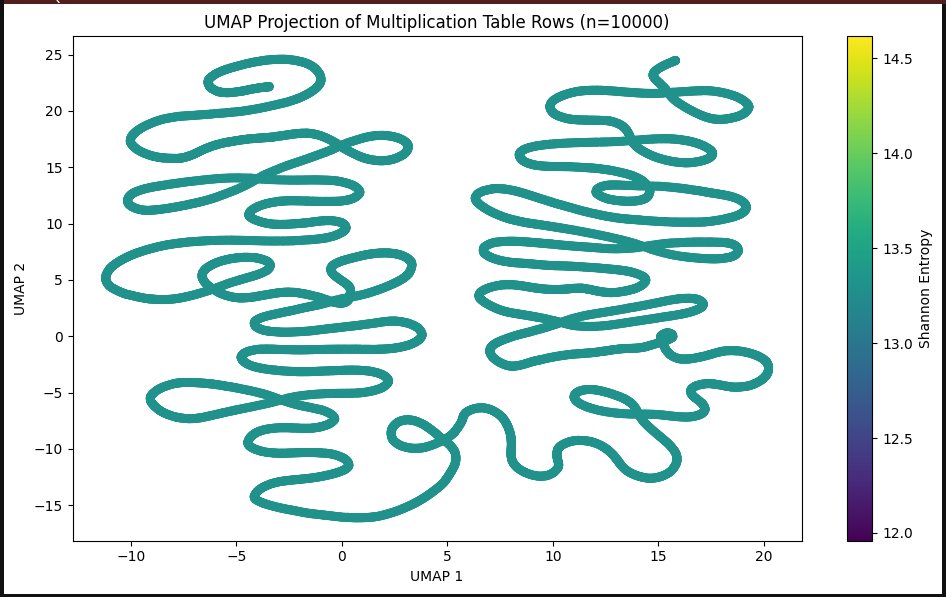

# Semantic Regimes of Multiplication: An Exploration Using Entropy and UMAP

## Overview

This project explores the structure of multiplication tables through the lens of entropy and unsupervised learning techniques like UMAP (Uniform Manifold Approximation and Projection) and HDBSCAN (Hierarchical Density-Based Spatial Clustering of Applications with Noise). By applying these methods, we uncover distinct clusters of multiplication rows, which exhibit semantic regimes based on arithmetic properties like the number of distinct prime divisors and multiplicative complexity. This unsupervised analysis helps visualize the topological structure of multiplication, providing a new way to view the multiplication table in terms of its arithmetic behaviors.

## Key Concepts

### 1. **Shannon Entropy**
   - Entropy is used to measure the uncertainty or disorder within each row of the multiplication table. Rows with higher entropy have more varied products, while rows with lower entropy exhibit repetitive patterns.
   - Shannon entropy is calculated for each row to quantify its multiplicative complexity.

### 2. **UMAP (Dimensionality Reduction)**
   - UMAP is used to reduce the high-dimensional space of multiplication table rows to 2D for visualization. This allows us to see how rows with similar multiplicative behaviors group together.

### 3. **HDBSCAN Clustering**
   - HDBSCAN is applied to the UMAP projection to identify distinct clusters, revealing groups of multiplication rows that share similar divisibility patterns and behaviors.

## Visualizations

### 1. **UMAP Projection of Multiplication Table Rows (n=10,000)**

   This figure shows how the rows of the multiplication table (with 10,000 integers) are projected into a 2D space using UMAP, colored by Shannon entropy. Rows with similar multiplicative behaviors are grouped together, and the color gradient reflects the level of entropy, with darker colors indicating higher entropy.

   

   **Caption**: UMAP projection of multiplication table rows (n=10,000), colored by Shannon entropy. Rows with similar multiplicative behavior are grouped together in the 2D space. Higher entropy indicates more variation in products.

### 2. **Mean Number of Prime Divisors per Cluster**

   This plot shows the relationship between the number of distinct prime divisors and the clusters identified using HDBSCAN. As we move across the clusters, the mean number of prime divisors increases, suggesting a correlation between the complexity of the multiplication pattern and the number of prime divisors.

   

   **Caption**: Mean number of prime divisors (\( \omega(n) \)) per cluster. As the index increases, the multiplicative complexity (as measured by the number of prime divisors) rises.

### 3. **HDBSCAN Clusters in UMAP Space**

   This figure shows the HDBSCAN clustering applied to the UMAP projection of multiplication table rows. Each color represents a distinct cluster with similar multiplicative properties.

   

   **Caption**: HDBSCAN clustering of UMAP-projected multiplication table rows (n=10,000). Each color represents a distinct cluster, with rows exhibiting different multiplicative properties.

### 4. **Semantic Regimes of Multiplication in UMAP Space**

   The final visualization labels and maps the five identified semantic regimes of multiplication in the UMAP space. These regimes represent different arithmetic behaviors of multiplication rows, categorized by entropy and prime divisor structure.

   

   **Caption**: Semantic regimes of multiplication in UMAP space, based on HDBSCAN clustering. The distinct clusters are color-coded to reflect the different arithmetic behaviors, ranging from prime-heavy to highly composite rows.

